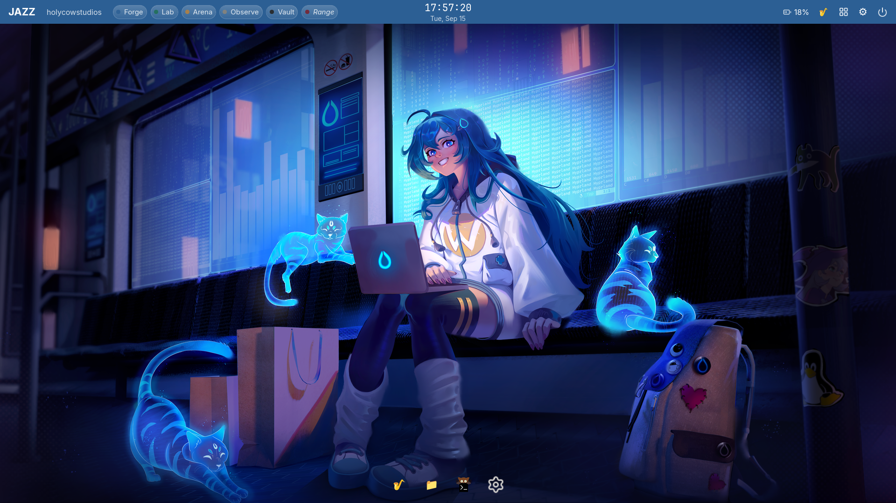

# JAZZ

**An Arch Linux desktop built for AI engineering — where color tells you the truth about your system, not just decorates it.**

JAZZ is a complete, opinionated Linux workstation for people building with AI: local models, notebooks, containers, and red-team testing, all on hardware you already own. You don't glue this together yourself from twenty blog posts. You clone one repo, run two commands, and you have it — Hyprland, a hand-built desktop shell, PyTorch, JupyterLab, Ollama, PyRIT, and a set of workspaces that actually mean something, all pre-wired and already talking to each other.

It is not a distro fork and not a theme pack on top of someone else's desktop. It installs as a script on top of vanilla Arch rather than a custom ISO — a deliberate v1 choice, not a limitation: a custom ISO (Omarchy now ships one) is real, ongoing maintenance (build pipeline, signing, CI boot-testing), worth taking on if there's real demand for GUI-first onboarding, not assumed up front. Built and verified from scratch by one person with an AI pair-programmer, and running as a real daily-driver dual-boot install on an ordinary laptop today — not a VM screenshot.

If you're going to spend a weekend setting up a Linux box for AI work anyway, spend it running JAZZ's install script instead of hand-rolling your own.



**[Why JAZZ](#why-jazz-and-not-just-vanilla-hyprland-or-omarchy)** · **[What you get](#what-you-get)** · **[Install it](#install-it)** · **[Project status](#project-status)** · **[Known issues](#known-issues)** · **[Docs](#documentation)**

---

## Why JAZZ, and not just vanilla Hyprland or Omarchy

**Your workspaces are named for what you're actually doing, and the color is never just decoration.**
Six workspaces — Forge, Lab, Arena, Observe, Vault, Range — each with its own identity color that shows up everywhere: the top bar, window borders, the dock, Settings. Forge is where you code. Lab is your notebooks. Arena is where you red-team your own local models. Observe is a live AI/system dashboard. Vault is where secrets live, deliberately the least inviting workspace. Range is reserved for a future conventional red-team lab layer. Nothing here is arbitrary — every color is a real, designed signal, not a wallpaper-derived accident.

**AI engineering tooling isn't something you bolt on later — it's there on first boot.**
Rootless Podman, PyTorch + JupyterLab in a ready-to-build container, Ollama for local inference, and PyRIT wired directly at your local model for AI red-teaming — all installed, all verified working, before you've customized a single thing.

**It refuses to fake a number.**
If a metric can't be measured honestly on your hardware yet (GPU utilization on some iGPUs, for instance), JAZZ's dashboard says so plainly instead of showing you a number that doesn't mean anything. This same honesty runs through the whole project: the README you're reading right now tells you about a real, unresolved boot-delay quirk instead of hiding it.

**Real apps, not re-skinned defaults.**
Jazz Files and Jazz Settings are genuinely built for this project — multi-pane file management with real undo, a full settings app with Appearance/Desktop/Users/Applications/Accessibility tabs — not Nautilus and GNOME Settings with a new wallpaper.

**It's proven on real hardware, not just a clean VM.**
Every verification pass in this project runs against real installs — including a genuine dual-boot install on a Ryzen-based laptop next to an existing Windows partition, with the Windows install left completely intact.

**It looks the part.**
The default look is a researched, jewel-toned "Sapphire" theme — deep navy chrome, antique gold accents, and workspace colors drawn from real gemstones (sapphire, emerald, topaz, onyx, garnet, smoky quartz). This isn't a default anyone shipped by accident — every color was checked against real luxury-design references before being adopted.

---

## What you get

| Layer | What's in it |
|---|---|
| **Base system** | Arch Linux, Btrfs + Snapper (automatic pre-change snapshots, real tested rollback), systemd-boot |
| **Desktop** | Hyprland (tiling Wayland compositor) + a hand-built Quickshell shell — top bar, transparent macOS-style dock, native app launcher, quick settings, power menu |
| **Jazz Settings** | Appearance (themes, wallpapers, fonts), Desktop (workspace naming/colors), Users (add/remove accounts, each provisioned with the full JAZZ desktop automatically), Applications, Accessibility |
| **Jazz Files** | A real GUI file manager — multi-pane, undo/redo, no AI bolted on for the sake of it |
| **AI engineering** | Rootless Podman, a PyTorch + JupyterLab container (CPU today, the same container validates unmodified against a rented cloud GPU), Ollama for local model inference |
| **AI red-teaming** | PyRIT, pointed at your local Ollama model out of the box — the "Arena" workspace is built around this |
| **Everyday desktop** | A curated app layer (browser, office, media, communication) plus daily-life widgets — clock, world clock, notes, to-do, pomodoro, more on the way |
| **Screenshots** | Region/window/full-screen capture, straight to clipboard, with an annotate step before you share it |
| **Keyboard-first** | No title bars, no window buttons — every action has a real keybind (`docs/Keybinds.md` is the living reference, kept in sync with the actual config, not aspirational) |

---

## Install it

This guide assumes no prior Linux experience — every step says what to type and what you should expect to see. It's also the exact sequence verified live, start to finish, on real hardware that had never run Arch (or any Arch-based distro) before.

You need: a machine that can boot the official Arch Linux ISO (a spare drive, a VM, or free space next to an existing OS — JAZZ has been dual-boot-installed next to Windows, and clean-installed over a wiped drive, without issues either way). A wired ethernet connection makes the early steps simpler, but wifi works fine too — covered below.

**1. Make a bootable USB drive.**
Download the ISO from [archlinux.org/download](https://archlinux.org/download/). Then write it to a USB drive (8GB or larger — this erases everything on the drive, so use a spare one):
- **Windows**: [Rufus](https://rufus.ie/) — open it, select the ISO and the USB drive, click Start.
- **Mac/Linux**: [balenaEtcher](https://etcher.balena.io/) — same idea, a simple drag-and-select GUI.

**2. Boot from the USB drive.**
Restart the machine and, before it loads its normal OS, press the boot-menu key repeatedly — this varies by manufacturer (common ones: `F12`, `F9`, `Esc`, `Del`). Pick the USB drive from the list. You'll land at a black screen with a `root@archiso` prompt — this is a normal terminal, not a crash.

**3. Connect to the internet.**
If you're on ethernet, this is usually already done — skip to step 4. For wifi:
```bash
iwctl device list                              # note your adapter's name, usually wlan0
iwctl station wlan0 scan
iwctl station wlan0 get-networks                # find your network's name in this list
iwctl station wlan0 connect "YOUR-WIFI-NAME"    # it'll prompt for the password
```
Confirm it worked:
```bash
ping -c 2 archlinux.org
```
If you see real replies (not "could not resolve" or timeouts), you're online.

**4. Install git, then clone the repo.**
The live installer doesn't include `git` by default:
```bash
pacman -Sy --noconfirm git
git clone https://github.com/holycowprojects/jazz.git
cd jazz
```

**5. Fill in your own username and passwords.**
```bash
cp install/base-credentials.json.example install/base-credentials.json
nano install/base-credentials.json
```
This opens a plain text editor. Replace all three occurrences of `"changeme"` with your own root password, your desired username, and your desired user password (real values, not placeholders — this is what you'll actually log in with). To save and exit nano: **`Ctrl+O`**, then **Enter** to confirm the filename, then **`Ctrl+X`** to exit.

**6. Run archinstall with JAZZ's profile.**
```bash
archinstall --config install/base-profile.json --creds install/base-credentials.json
```
This opens a menu you navigate with arrow keys and Enter. Every JAZZ-specific choice (Hyprland desktop, Btrfs/Snapper filesystem, kernel, locale, and everything else) is already filled in — you'll see each one listed as already configured. The **one thing left to set up is the disk**, and this is the single most important moment in the whole install, since **everything on the drive you pick will be erased:**

1. Select **"Disk configuration"** from the menu, press Enter.
2. Choose **"Use a best-effort default partition layout."**
3. Pick your real disk from the list — if you're not sure which is which, go by size: your main internal drive is almost always the larger one, a USB installer the smaller one.
4. Confirm the wipe.
5. Filesystem: choose **BTRFS**. When asked, enable **compression**, and leave **Copy-on-Write enabled** — don't disable it, JAZZ's snapshot/rollback system depends on it.
6. Back at the main menu, everything should now show as configured. Choose **"Install"** to begin.

It downloads and installs real packages at this point, so it takes a few minutes — let it run.

(Dual-booting next to an existing Windows install on the same disk? `install/bare-metal-profile.json` is the real profile used for exactly that on this project's own reference laptop — read it before adapting it to your own disk layout, since that's a more involved, higher-stakes partitioning scenario than a full-disk install.)

**7. Reboot into your new system.**
```bash
reboot
```
Remove the USB drive once the screen goes black (or make sure your BIOS boot order won't pick it again), then let it boot into the system you just installed. Log in with the username and password you set in step 5.

**8. Reconnect to the internet.**
Your live-installer wifi connection doesn't carry over — the installed system uses a different network tool (NetworkManager, not `iwctl`). At this point you're looking at stock Hyprland, not JAZZ yet (that's what the next step builds) — there's no desktop or right-click menu, just a blank screen. Press **`Super+Q`** (the Windows/Meta key + Q) to open a terminal, then run:
```bash
nmcli device wifi list
nmcli device wifi connect "YOUR-WIFI-NAME" password "YOUR-WIFI-PASSWORD"
```
Skip this if you're on ethernet.

**9. Run the real JAZZ setup.**
Become root, then run the one script that builds everything else:
```bash
sudo -i
git clone https://github.com/holycowprojects/jazz.git /opt/jazz-src
cd /opt/jazz-src
bash scripts/install-jazz.sh <your-username>
```
Replace `<your-username>` with the username you actually created. This one script brings up the full desktop shell, theming, AI tooling, red-team tooling, and the everyday app layer, in order — it downloads a substantial amount (the AI stack and the desktop app layer are both sizeable), so expect it to take a while, particularly on slower connections. It's idempotent: if it's interrupted (a network hiccup, for instance) or you want to update later, `git pull` and run it again safely — it picks up where it left off.

**10. Reboot and log in — you're done.**
```bash
reboot
```
Sapphire theme, gemstone workspaces, a working dock and launcher, and a fully wired AI stack, right on first login. `docs/Keybinds.md` is your reference for how to actually drive the desktop — JAZZ has no title bars or window buttons, every action is a keybind.

Want to add another user later? Open Jazz Settings → Users → Add — they get the complete JAZZ desktop automatically, not a bare Hyprland session.

---

## Project status

JAZZ is under active, transparent development — this isn't a finished 1.0 yet, but nothing described above is aspirational. Every claim in this README maps to a real, individually-verified piece of work:

- **Filesystem & recovery** (Btrfs, Snapper, tested rollback) — done, verified.
- **Desktop shell** (Hyprland, Quickshell, top bar, dock, launcher, Settings, Files) — done, verified, live-tested on real hardware.
- **AI engineering stack** (Podman, PyTorch/JupyterLab, Ollama) — done, verified.
- **AI red-teaming** (PyRIT against a local model) — done, verified.
- **Bare-metal, dual-boot install** — done: installed on a real laptop (Lenovo Yoga 6, AMD Ryzen 7 4700U) alongside an existing Windows install, all verification checks passing on real hardware, real `amdgpu` GPU rendering confirmed (not software fallback).
- **Multi-user provisioning, boot branding, design polish** — done, including the theme and workspace-color work described above.
- **Stranger's-machine install test** — done: a full clean install on a second, previously-Windows-only laptop (HP Pavilion, Intel i3) that had never run Arch before, found and fixed seven real bugs invisible on the original dev hardware.
- **Cloud GPU validation** — done: JAZZ's own PyTorch container, completely unmodified, rented a real NVIDIA RTX 4090 (Vast.ai) and ran CUDA-accelerated — `torch.cuda.is_available()` returned `True`, and a real matmul benchmark measured a **64.3x speedup** over CPU (155.6ms vs 2.4ms per iteration on a 4096×4096 float32 matmul).
- **Public-repo hygiene pass and a from-scratch clean-install verification** — done: full-history secret scan clean, no hardcoded personal paths, ShellCheck-clean install scripts.

As of 17 Sept 2026, **JAZZ meets all of `docs/SPEC.md`'s success criteria** — everything above is real, verified, and running on two independent physical machines, not a VM.

The conventional cybersecurity red-team lab layer (the dormant "Range" workspace) is deliberately deferred — not because it's hard in general, but because this Windows-hosted development environment's virtualization backend can't run the nested VMs that layer needs. It's scoped for later, on different hardware.

**JAZZ v1 is beta.** It's real, daily-driver software — not a demo — but it's had two people and two laptops behind it so far, not thousands. If you install it and hit a bug, or there's a feature you'd want in JAZZ v2, email **office@holycowstudios.in**. Both bug reports and feature requests are genuinely welcome — this is early enough that real usage from outside its own build process is exactly what it needs next.

## Known Issues

**Boot takes longer than expected on AMD Renoir/Cezanne laptops (e.g. Lenovo Yoga 6 82FN) — it will still boot, just not quickly.** On some AMD Ryzen 4000/5000-mobile ("Renoir"/"Cezanne") laptops, an integrated USB peripheral (commonly the webcam) fails to respond during early boot, and the kernel's USB stack retries repeatedly before giving up — adding well over a minute before the desktop appears. This is a known chipset/peripheral timing issue (see `docs/Research-Reference-List.md` for the full trail and sources), not something JAZZ's own scripts cause, and it isn't specific to any one physical unit — any Linux distro on the same chipset family will show the same symptom (`dmesg`/`journalctl -b` will show repeated `usb N-M: device descriptor read/64, error -110` lines from the same port).

JAZZ does **not** currently hide this delay behind a boot splash — Plymouth was tried and then deliberately reverted back to plain scrolling boot text, specifically so this delay stays visible as real progress (it's still moving, just slow) rather than reading as a silent hang.

**A universal fix (bounding how long boot waits on any slow/misbehaving USB device, not specific to any one machine's exact hardware) is planned for v2, not v1** — deliberately not rushed. If you don't need the affected device (usually the integrated camera) and want to remove the delay now, disabling it in your BIOS/UEFI setup is a workaround, not something JAZZ does for you.

**Screen-reader support is not currently achievable** — this is an upstream Hyprland/wlroots limitation (Orca's AT-SPI2/D-Bus dependencies aren't reliably supported on wlroots-based compositors as of 2026), not a JAZZ gap. Reduced-motion and UI scaling are supported; full screen-reader compatibility is honestly out of reach until that changes upstream.

**If your lock screen (`hyprlock`) ever crashes or is killed abnormally, your screen can get stuck locked with no on-screen way out.** This isn't a JAZZ-specific bug — it's Wayland's session-lock protocol working as designed: once a client locks the session, the compositor is required to keep the screen blanked and input blocked until that same client explicitly releases it. If the lock client disappears any other way (a crash, or being force-killed), the compositor correctly refuses to auto-unlock — treating a crash as a valid way to bypass a lock screen would defeat the whole point of having one. The practical effect is a real dead end at the keyboard: no password prompt is left to type into.

**Recovery:** from another device on the same network, SSH in and run:
```bash
hyprctl dispatch "hl.dsp.exit()"
```
This exits Hyprland entirely (no reboot needed, filesystem untouched) and hands control back to the `ly` login screen, where you can log in again normally. Any unsaved state in apps that were open is lost, same as ending any session. If you don't have another device to SSH from, a full reboot achieves the same recovery.

Two AMD iGPU/audio quirks were investigated and closed as non-issues on the reference hardware — see `CHANGELOG.md` if you hit something that looks similar.

---

## Documentation

- `docs/SPEC.md` — the full technical spec: scope, tech stack, project structure, success criteria
- `docs/Design-Vision.md` — the design philosophy behind the workspace colors, animation choices, and what's honestly aspirational vs. real
- `docs/Keybinds.md` — the complete, always-current keybind reference
- `docs/JAZZ-v2.md` — what's planned beyond this release
- `tasks/todo.md` — the full build log, task by task, including every real bug found and how it was fixed
- `CHANGELOG.md` — dated summary of what's shipped

## Philosophy

JAZZ is built two ways at once: as a genuinely useful daily-driver OS, and as a fully transparent record of how it was built — every non-obvious decision, every dead end, every real bug and its actual root cause is recorded in this repo's own history and `tasks/todo.md`, not smoothed over. If you're learning Linux, Hyprland, or how to build a real system with an AI pair-programmer rather than just prompt it for snippets, the build log is as much the product as the desktop is.

## License

MIT. Copyright © 2026 Akash Navet, Holy Cow Studios Pvt Ltd. See `LICENSE`.

## Credits

Built by **Akash Navet** (Holy Cow Studios Pvt Ltd) and **Claude**.
